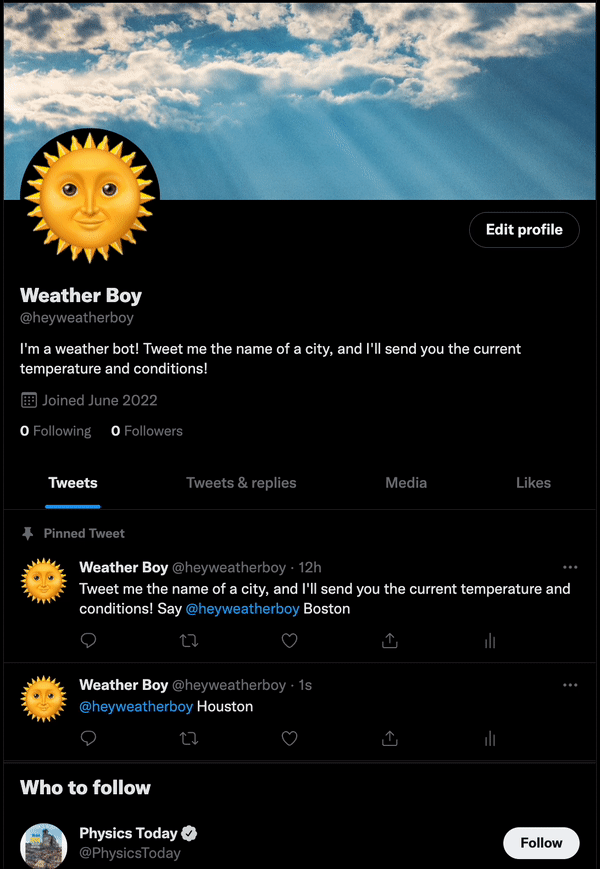

# weatherboy

I'm Twitter bot that tweets back the current temperature and conditions.

## Demo

## Built With

- [Python](https://github.com/python)
- [Google Cloud Platform](https://github.com/GoogleCloudPlatform)

## Acknowledgments

- [tweepy](https://github.com/tweepy/)
- [Weather API](https://github.com/weatherapicom/)
